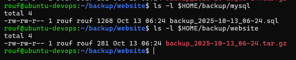
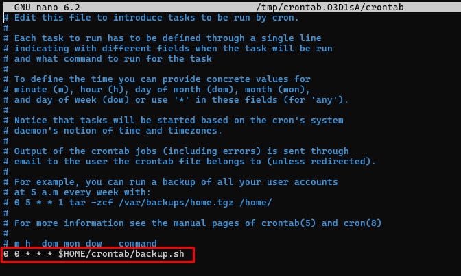

# Backup Database Mysql
Script ini bertujuan untuk membackup sebuah database mysql dan file website lalu memasukannya ke direktori backup, Di lengkapi dengan crontab maka crontab akan mengeksekusi script setiap hari.Dan jika file backup sudah lebih dari 5 file maka script akan menghapus file yang sudah lama dan mempertahankan yang terbaru.Hasil backup database berisi informarsi lengkap database, untuk file website di backup menggunakan ektensi .tar .

# Setup

1. Setup mysql client + Server
```bash
sudo apt update -y
sudo apt install mysql-client -y
sudo apt install mysql-server -y
```

2. Jalankan Mysql Server
```bash
sudo systemctl start mysql
sudo systemctl enable mysql
```

3. Setup Awal database Mysql
```bash
sudo mysql
```

4. Membuat database, Setup password root user, Refresh permission MySQL.
```bash
CREATE DATABASE db_crud;
ALTER USER 'root'@'localhost' IDENTIFIED  WITH mysql_native_password BY 'rouf';
FLUSH PRIVILEGES;
EXIT;
```
note: sesuaikan password root di script

5. Buat direktori website
```bash
sudo mkdir -p /var/www/simple-crud-php
sudo chown rouf:rouf /var/www/simple-crud-php
```

6. Buat beberapa file untuk contoh
```bash
cd /var/www/simple-crud-php
# Membuat file HTML sederhana
echo "<h1>Halo, ini halaman utama.</h1>" > index.html

# Membuat file teks biasa
echo "Ini adalah file konfigurasi contoh." > config.txt

# Membuat file kosong
touch style.css
```

7. Verifikasi 
```bash
# Untuk melihat backup database
ls -l $HOME/backup/mysql

# Untuk melihat backup website
ls -l $HOME/backup/website
```



8. Lakukan konfigurasi Crontab untuk menjadwalkan script otomatis
```bash
crontab -e
```
