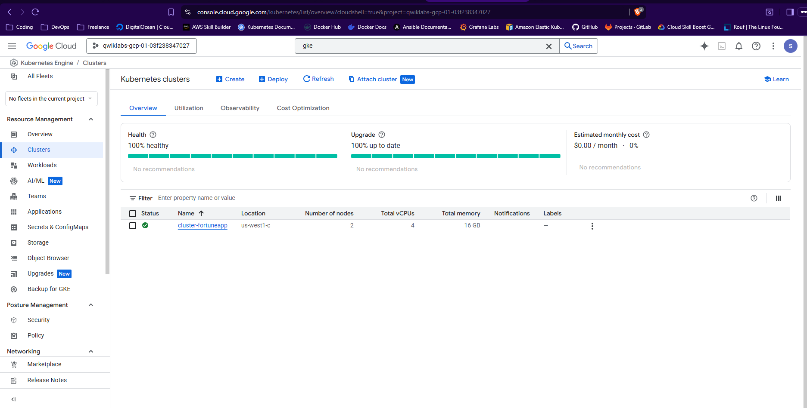

# Script Cluster GKE (Google Kubernetes Engine) 
note: Kode script ini mengambil refrensi dari Google cloud skill boost, Script ini hanya berjalan di Google Cloud.

## Cara Menjalankan script ini

1. Download file script
```bash
curl -L -O https://raw.githubusercontent.com/MochamadAbdulRouf/Hands-on-Bash-Script-Labs/refs/heads/master/create-clusters-gke/cluster-gke.sh 
```

2. Berikan izin eksekusi kepada file script
```bash
chmod +x cluster-gke.sh
```

3. Jalankan Script
```bash
./cluster-gke.sh
```

### Contoh hasil script yang telah dijalankan

1. Log 1 (saat script sedang berjalan)
```bash
student_04_e054dd34acd8@cloudshell:~ (qwiklabs-gcp-01-03f238347027)$ ./cluster-gke.sh 
++ gcloud compute project-info describe '--format=value(commonInstanceMetadata.items[google-compute-default-zone])'
+ export ZONE=us-west1-c
+ ZONE=us-west1-c
+ gcloud config set compute/zone us-west1-c
Updated property [compute/zone].
+ gcloud container clusters create cluster-fortuneapp --num-nodes 2 --machine-type e2-standard-2 --scopes https://www.googleapis.com/auth/projecthosting,storage-rw
Note: Your Pod address range (`--cluster-ipv4-cidr`) can accommodate at most 1008 node(s).
Creating cluster cluster-fortuneapp in us-west1-c... Cluster is being health-checked (Kubernetes Control Plane is healthy)...done.                                                                  
Created [https://container.googleapis.com/v1/projects/qwiklabs-gcp-01-03f238347027/zones/us-west1-c/clusters/cluster-fortuneapp].
To inspect the contents of your cluster, go to: https://console.cloud.google.com/kubernetes/workload_/gcloud/us-west1-c/cluster-fortuneapp?project=qwiklabs-gcp-01-03f238347027
kubeconfig entry generated for cluster-fortuneapp.
NAME: cluster-fortuneapp
LOCATION: us-west1-c
MASTER_VERSION: 1.33.5-gke.1201000
MASTER_IP: 34.19.108.95
MACHINE_TYPE: e2-standard-2
NODE_VERSION: 1.33.5-gke.1201000
NUM_NODES: 2
STATUS: RUNNING
STACK_TYPE: IPV4
+ sleep 15
+ gcloud container clusters get-credentials cluster-fortuneapp
Fetching cluster endpoint and auth data.
kubeconfig entry generated for cluster-fortuneapp.
```

2. Dokumentasi di Dashboard GKE Google Cloud
