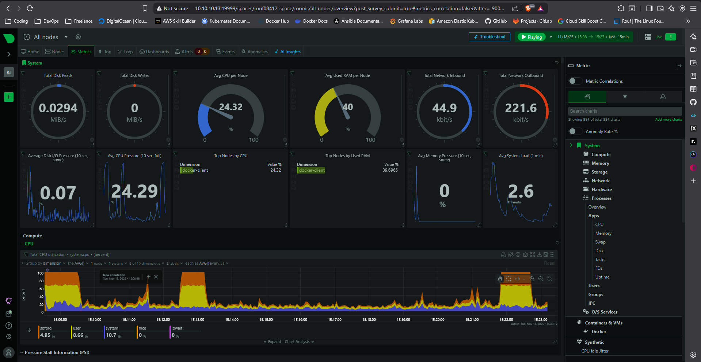

# Simple Monitoring Netdata
This project implements Netdata Monitoring, understanding of Observability, lifecycle management, validation and testing, as well as troubleshooting and debugging.



## How to run this project?

1. Download file script
```bash
curl -LO https://raw.githubusercontent.com/MochamadAbdulRouf/Hands-on-Bash-Script-Labs/refs/heads/master/simple-monitoring-Netdata/cleanup.sh
```
```bash
curl -LO https://raw.githubusercontent.com/MochamadAbdulRouf/Hands-on-Bash-Script-Labs/refs/heads/master/simple-monitoring-Netdata/setup.sh
```
```bash
curl -LO https://raw.githubusercontent.com/MochamadAbdulRouf/Hands-on-Bash-Script-Labs/refs/heads/master/simple-monitoring-Netdata/test_dashboard.sh
```

2. Give permission for execution to file script
```bash
chmod +x setup.sh
chmod +x test_dashboard.sh
chmod +x cleanup.sh
```

3. Running script
```bash
./setup.sh
./test_dashboard.sh
./cleanup.sh
```